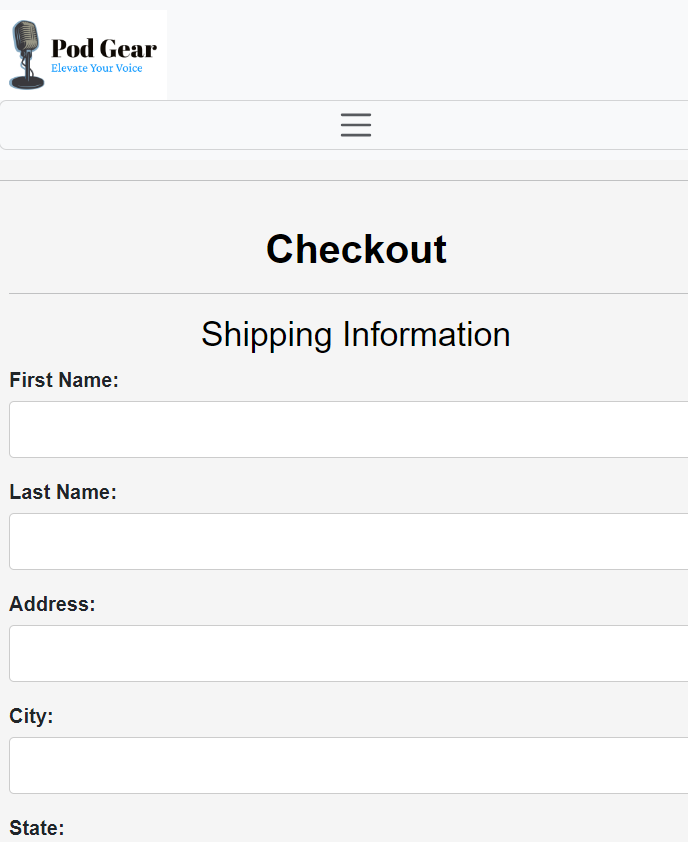

# Pod Gear E-commerce Shop

## Overview

 welcome to Pod Gear E-Commerce Shop. This is a one-stop shop for all podcast equipment. we sell afforable, high-quality equipment for both beginner and professional and beginner podcasters.
 
This is my capstone projcet for my Front-end Developer class

##Technology Use
>HTML>
>CSS>
>Bootstrap>

This is my Home Page, providing you a discription of our site and our top priorities as a brand. This page als features some of our best-selling microphones.

This is my Product Page featuring six of our most in-demand equipment items currently in stock.

This is my Register Page for customer who do not have an account with us. it includesbeasy fill-in sections and "How did you hear about us" questions with option answers. I will use this information to track which channels are most successful in attracting customers.

This is my Login page for customes who already have an account with us. There is also anoptionto reset your password when you click on "forgot password".
clicking on "Create Account" will take you to the registerion page if the customer doesn't have an account with us.

This is  the CheckOut Page. It features an easy-to-fill form for entering the shipping adress and payment information. It also provides an overall of the purchased items, including their description, quanity, price and the overall total amount