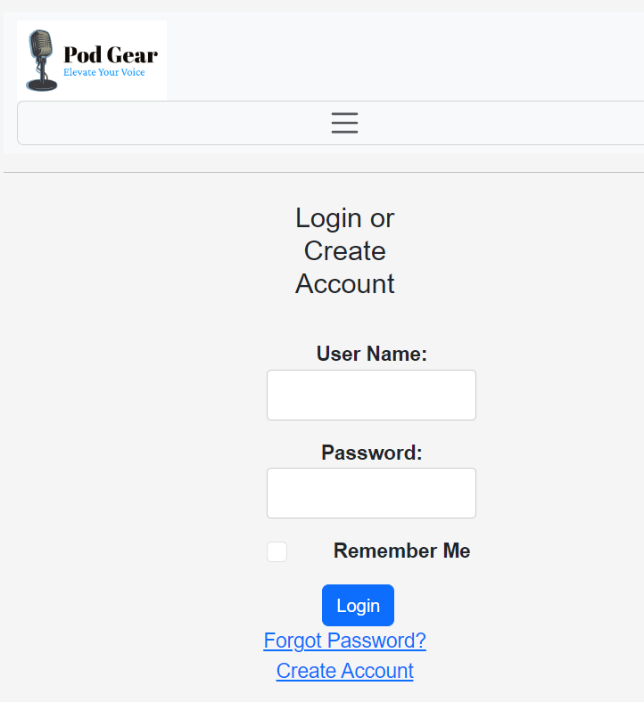

# Pod Gear E-commerce Shop

## Overview

 Welcome to Pod Gear E-Commerce Shop. This is a one-stop shop for all podcast equipments. we sell afforable, high-quality equipment for both professionals and beginners podcasters.
 
This is my capstone projcet for my Front-end Developer class.

## Technology Use
>HTML

>CSS

>Bootstrap

This is the Home Page, providing you a discription of our site and our top priorities as a brand. This page also features some of our best-selling microphones.

This is the Product Page featuring six of our most in-demand equipments currently in stock.
>I enjoyed using both HTML and CSS to style my product page. It was a little challenging getting all the products to align, but my instructor was very helpful in guiding me to achieve the look I wanted. 

Below is an example of the style I use in HTML.

This is the Register Page for customer who do not have an account with us. it includes an easy fill-in section and "How did you hear about us" questions with option answers. This feature is use to track which channels are most successful in attracting customers.

This is the Login page for customes who already have an account with us. There is also an option to reset your password when you click on "forgot password".
clicking on "Create Account" will take you to the registerion page if the customer doesn't have an account with us.

This is the Checkout Page. It features an easy-to-fill form for entering the shipping adress and payment information. It also provides an overall of the purchased items, including their description, quanity, price and the overall total amount.

# Thank You For Reading!